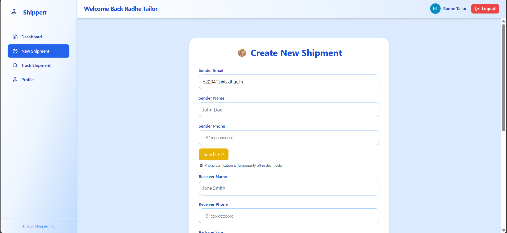

# 🚚 Shipperr - Shipment Delivery Web App

**Shipperr** is a modern and responsive shipment delivery management web application built with React and Firebase. It allows users to create shipments, track them in real time, and manage their profile. An admin panel is also included to manage and monitor all shipments.

## 🔗 Live Site

[https://shipperr-radhe-tailor.vercel.app/](https://shipperr-radhe-tailor.vercel.app/)


## ✨ Features

### 👤 User Functionality
- ✅ User registration & login (Email, Google, Phone OTP via Firebase Auth)
- 📦 Create new shipments with sender & receiver details
- 🔍 Track shipments using tracking ID
- 🧾 View shipment history and detailed status
- 🧑‍💼 Manage profile (including profile photo)

### 🛠 Admin Functionality
- 📊 Admin dashboard to view & manage all shipments
- 🔄 Update shipment status
- 📝 Add internal notes for shipments
- 📁 Expandable shipment details view
- 📱 Fully responsive with sidebar toggle for mobile

### 💄 UI/UX
- 🎨 Clean and modern design with gradients
- 📱 Mobile responsive dashboard
- 🌙 Light theme across all components
- 🔁 Reusable components: Modal, Layouts, Tables

## 🧰 Tech Stack

| Tech             | Purpose                               |
|------------------|----------------------------------------|
| React.js         | Frontend UI                            |
| Firebase Auth    | User authentication (Email, Phone)     |
| Firestore DB     | Realtime database for storing shipments|
| Tailwind CSS     | Responsive UI styling                  |
| React Router DOM | Page routing                           |
| React Icons      | Icons and UI elements                  |

## 📸 Screenshots

> Add your screenshots here  
  


- Dashboard view  
- Shipment creation form  
- Track shipment modal  
- Admin panel  
- Mobile view toggle sidebar


## 🚀 Getting Started

### 1. Clone the repository

```bash
git clone https://github.com/nimish2004/Shipperr
cd Shipperr


```

### 2. Install dependencies

```bash
npm install
```

### 4. Run the development server

```bash
npm run dev
```


## 🗃 Folder Structure

```bash
src/
├── components/        # Reusable UI components (Sidebar, Navbar, Modal)
├── pages/             # Page-level components (Dashboard, Track, Create)
├── admin/             # Admin panel components
├── firebase.js        # Firebase config
└── App.jsx            # Main app with routing
```


